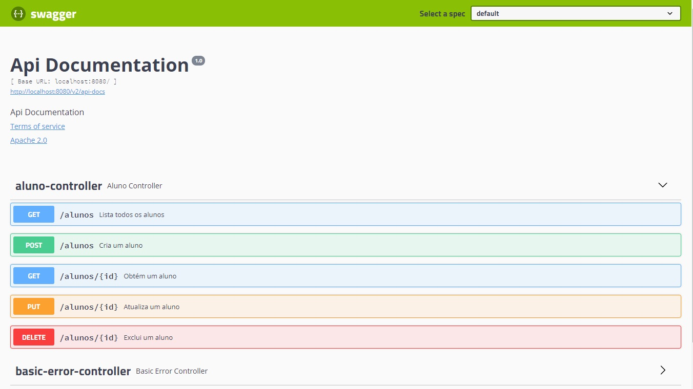
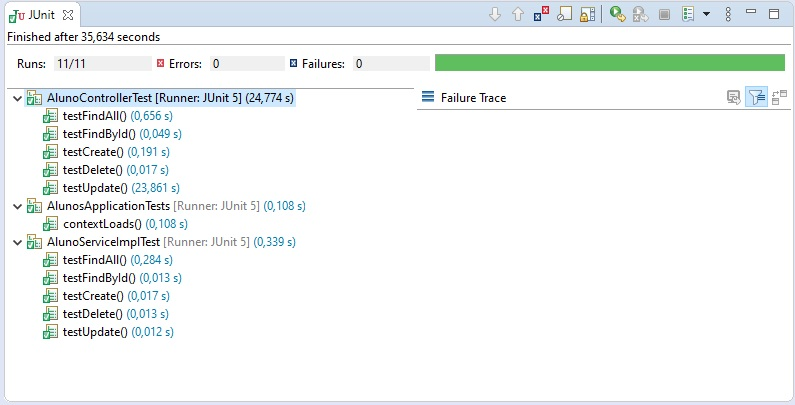

# Projeto Cartão de Crédito FIAP - Alunos

## Pré-requisitos para execução da aplicação de alunos

- Tecnologias necessárias.

  1- Para executar o projeto é necessário ter o JRE 8 ou JDK 8 instalado.
  
  2- Utilizar uma IDE para execução. (Eclipse é recomendado)
  
 ---

## Componentes utilizados

  - Spring Web
  
  - Spring JPA
  
  - H2 Database
  
  - JUnit (testes)
  
  - Swagger (documentação)

 ---

## Instalação e execução do projeto

`$ git clone https://github.com/camisbressan/fiap-cartao-alunos.git`

Após executar a aplicação de Alunos, no diretório `src` no pacote `br.com.fiap.alunos` existe um arquivo chamado `AlunosApplication.java`. Abra esse arquivo e execute Run.

A carga de dados inicial feita através do arquivo disponibilizado no Google Drive (https://drive.google.com/open?id=19ILqrYjOEe4C840ZRwhKDauvhDZCKcWa) pode ser validada pela API de listagem de alunos (http://localhost:8080/alunos) via H2 Console, via Swagger e via Postman.

Segue exemplos abaixo.

H2 Console - http://localhost:8080/h2/login.jsp

Swagger - http://localhost:8080/swagger-ui.html

Postman - GET: http://localhost:8080/alunos - Lista todos os alunos

## Demais rotas para gestão dos alunos

A aplicação permite a criação, alteração e exclusão de um aluno, além das rotas de listar todos os alunos e buscar um aluno específico.

http://localhost:8080/swagger-ui.html

## Testes unitários e integrados

